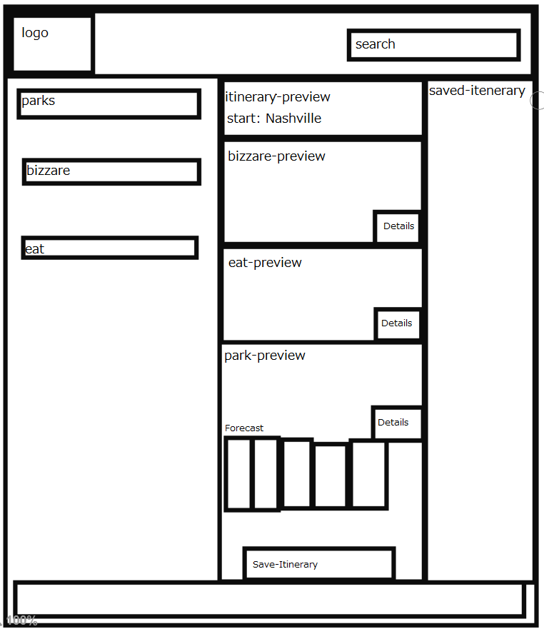

# B & B Trip Planner - readme

## How to use -

- First clone down the repo, to get the needed files.
- Once we have the files pulled down. You want to start a [JSON-Server](https://github.com/typicode/json-server) on the db.json so that you can use our local api.
- Then serve a localhost for your browser. You can use Live Server in vs code, which how I use the app. Or any other way you host html files locally.

### Settings

After you clone the repository, each must perform the following steps.

1. In the `scripts` directory, you will see a file named `.Settings.js`.
2. Copy that file with `cp .Settings.js Settings.js`.
3. Register an API key for the APIs below that need it.
4. Copy your key into the appropriate place in the `Settings.js` file.

## National Park Service API

- API home: https://www.nps.gov/subjects/digital/nps-data-api.htm
- API documentation: https://www.nps.gov/subjects/developer/api-documentation.htm

### List All Parks

https://developer.nps.gov/api/v1/parks?api_key=your_api_key

## Weather API

https://openweathermap.org/api

## Bizarre Destination

http://holidayroad.nss.team/bizarreries

## Eateries Destination

http://holidayroad.nss.team/eateries

## Who is the App for?

- We designed this app with Charles in mind - a person who enjoys the outdoors but needs to know that he has cell coverage and his accessability needs met.
- Because of that we added features to make sure that he can find out if the locations are accessible and have cell coverage.
- When deciding on a layout and design scheme we decided to use a lot of white space, because based on his persona that looked like a style he would like.
- We decided to go with a 3 column layout to make it easier to scan, and allows the user to manipulate the data left to right. Which should come natural to the user.

## Wireframe

